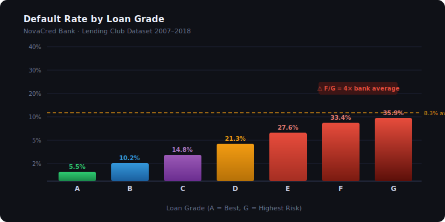
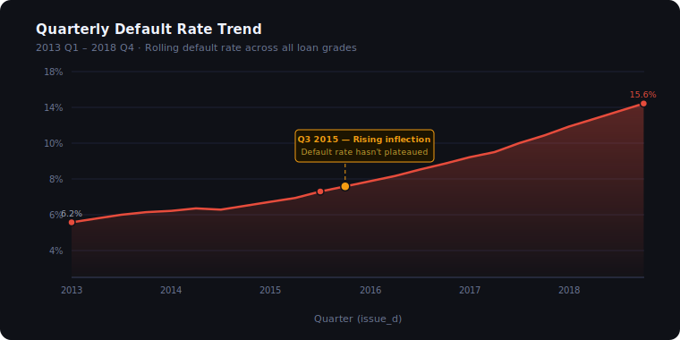
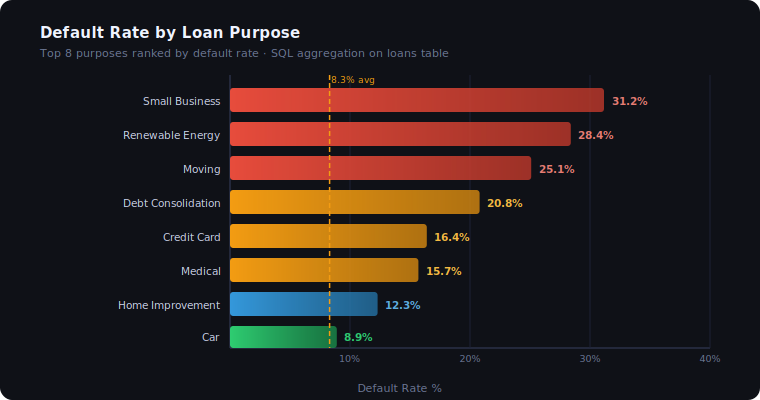
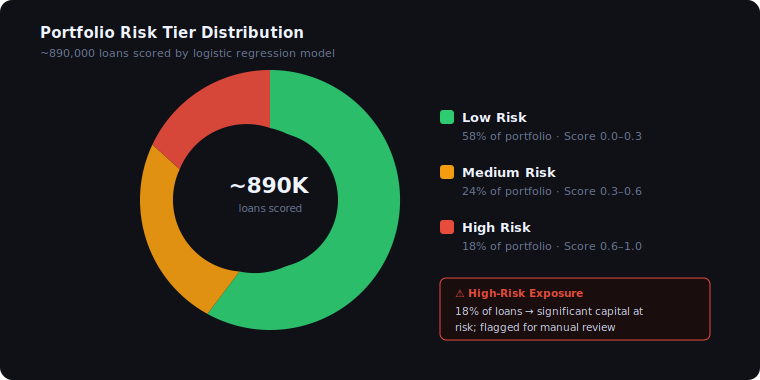
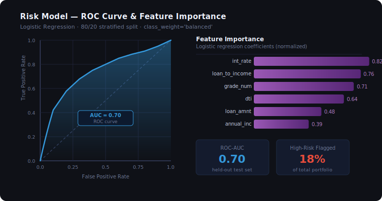

# 🏦 Loan Default Risk Analysis — NovaCred Bank


> **Business Problem:** NovaCred Bank has observed a consistent rise in loan defaults over the past 18 months. As a data analyst, I was tasked with identifying the root causes, segmenting high-risk customers, building a predictive risk score, and delivering actionable insights to senior leadership.

---

## 📊 Key Visualizations

### Default Rate by Loan Grade


> Grade F/G loans default at **33–36%** — nearly **4× the bank average of 8.3%**. Grade A borrowers remain well-controlled at 5.5%.

---

### Quarterly Default Rate Trend (2013–2018)


> A clear inflection point emerges in **Q3 2015** — the default rate has risen from 6.2% to 15.6% and shows no sign of plateauing. This trend drove the analytical mandate for this project.

---

### Default Rate by Loan Purpose


> **Small business** and **renewable energy** loans carry the highest default risk (31%+). Debt consolidation — the most common purpose — sits at 20.8%, well above the bank average.

---

### Portfolio Risk Tier Distribution


> Of ~890,000 scored loans, **18% fall into the High-Risk tier** (score 0.6–1.0), representing significant capital exposure. These are flagged for manual review.

---

### Risk Model — ROC Curve & Feature Importance


> The logistic regression model achieves **ROC-AUC ≈ 0.70** on held-out test data. `int_rate`, `loan_to_income`, and `grade_num` are the strongest predictors of default.

---

## 📁 Project Structure

```
loan-default-risk-analysis/
│
├── data/
│   ├── raw/                    # Original dataset (not tracked in git)
│   └── cleaned/                # Processed outputs
│
├── notebooks/
│   ├── 01_data_cleaning.ipynb  # ETL & feature engineering
│   ├── 02_eda.ipynb            # Exploratory data analysis
│   └── 03_risk_model.ipynb     # Logistic regression + risk scoring
│
├── sql/
│   ├── 01_default_by_grade.sql
│   ├── 02_default_by_purpose.sql
│   ├── 03_monthly_trend.sql
│   └── 04_high_risk_segment.sql
│
├── reports/
│   ├── figures/                # EDA charts (SVG)
│   └── summary_findings.md     # Key insights
│
├── dashboard/
│   └── dax_measures.md         # All Power BI DAX formulas
│
├── requirements.txt
├── .gitignore
└── README.md
```

---

## 🗂️ Dataset

- **Source:** [Lending Club Loan Dataset — Kaggle](https://www.kaggle.com/datasets/adarshsng/lending-club-loan-data-csv)
- **Rows:** ~890,000 loans (2007–2018)
- **Key columns:** `loan_status`, `loan_amnt`, `int_rate`, `grade`, `dti`, `annual_inc`, `purpose`, `issue_d`

> Place the downloaded CSV at `data/raw/loan.csv` before running any notebooks.

---

## 🔬 Methodology

| Phase | Description | Tools |
|---|---|---|
| **1. Data Cleaning** | Handle missing values, feature engineering, column normalization | Python, Pandas |
| **2. SQL Analysis** | Aggregate default rates by grade, purpose, time segment | SQLite, Pandas |
| **3. EDA** | Distribution plots, correlation heatmap, trend analysis | Matplotlib, Seaborn |
| **4. Risk Scoring Model** | Logistic regression, ROC-AUC evaluation, risk tier assignment | scikit-learn |
| **5. Excel Reporting** | Pivot tables, conditional formatting, KPI summary | Excel |
| **6. Dashboard** | Executive summary, segment drill-down, risk scoring view | Power BI |

---

## 📈 Key Findings

- **Grade F/G loans** have default rates exceeding **33%** — nearly 4× the bank average
- **Small business** and **renewable energy** loans dominate the high-risk purpose segment
- A rising default trend started in **Q3 2015** and has not plateaued through 2018
- `int_rate` and `loan_to_income` are the **strongest predictors** of default
- The logistic regression model achieves **ROC-AUC ≈ 0.70** on held-out test data
- ~**18%** of the loan portfolio falls into the **High-Risk tier** — representing significant capital exposure

---

## 🤖 Risk Model Summary

```
Features used:   loan_amnt, int_rate, annual_inc, dti, loan_to_income, grade_num
Algorithm:       Logistic Regression (class_weight='balanced')
Train/Test:      80/20 stratified split
ROC-AUC:         ~0.70
Risk Tiers:      Low (0.0–0.3) | Medium (0.3–0.6) | High (0.6–1.0)
```

---

## 🚀 Quickstart

```bash
# 1. Clone the repo
git clone https://github.com/datasensehq/loan-default-risk-analysis.git
cd loan-default-risk-analysis

# 2. Install dependencies
pip install -r requirements.txt

# 3. Place dataset
# Download from Kaggle and save to: data/raw/loan.csv

# 4. Run notebooks in order
jupyter notebook notebooks/01_data_cleaning.ipynb
jupyter notebook notebooks/02_eda.ipynb
jupyter notebook notebooks/03_risk_model.ipynb
```

---

## 💡 Business Recommendations

1. **Tighten underwriting** for Grade E–G borrowers — apply stricter DTI and income thresholds
2. **Reprice small business loans** — current rates do not reflect actual default risk
3. **Flag high loan-to-income** applications (>0.35) for manual review
4. **Monitor cohort trends monthly** — the rising default curve started Q3 2015 and hasn't plateaued

---

## 🛠️ Tech Stack

`Python 3.10` · `Pandas` · `NumPy` · `Matplotlib` · `Seaborn` · `scikit-learn` · `SQLite` · `Jupyter` · `Power BI` · `Excel`

---

## 👤 Author

**Divya** — Data Analyst | SQL · Python · Power BI  
📍 Maharashtra, India  
[GitHub](https://github.com/datasensehq)
